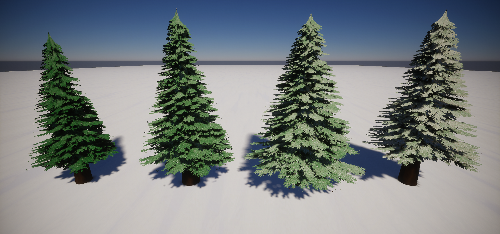
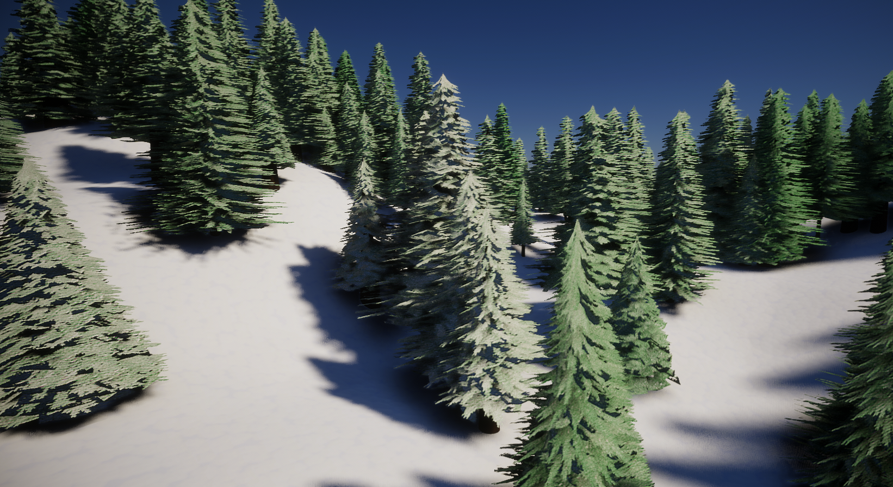

# Polyform

[](https://goreportcard.com/report/github.com/EliCDavis/polyform)

Library for generating and editing 3D geometry and it's associated data implemented in 100% golang.

If Polyform contributes to an academic publication, cite it as:

```
@misc{polyform,
  title = {Polyform},
  author = {Eli Davis},
  note = {https://www.github.com/EliCDavis/polyform},
  year = {2023}
}
```

## Processing Example

Reads in a obj and applies the cube marching algorithm over the meshes 3D SDF.

```go
package main

import (
  "github.com/EliCDavis/polyform/formats/obj"
  "github.com/EliCDavis/polyform/modeling"
  "github.com/EliCDavis/polyform/modeling/marching"
  "github.com/EliCDavis/polyform/modeling/meshops"
  "github.com/EliCDavis/vector"
)

func check(err error) {
  if err != nil {
    panic(err)
  }
}

func main() {
  loadedMesh, err := obj.Load("test-models/stanford-bunny.obj")
  check(err)

  resolution := 10.
  canvas := marching.NewMarchingCanvas(resolution)

  canvas.AddFieldParallel(marching.Mesh(
    loadedMesh.Transform(
      meshops.Center3DTransformer{},
      meshops.Scale3DTransformer{
        Amount: vector3.New(12, 12, 12),
      },
    ),
    .1,
    10,
  ))
  check(obj.Save("chunky-bunny.obj", canvas.MarchParallel(.3)))
}
```

Results in:


## Helpful Procedural Generation Sub Packages

- Modeling
  - [meshops](/modeling/meshops/) - All currently implemented algorithms for transforming meshes. 
  - [marching](/modeling/marching/) - Multi-threaded Cube Marching algorithm and utilities.
  - [extrude](/modeling/extrude/) - Functionality for generating geometry from 2D shapes.
  - [repeat](/modeling/repeat/) - Functionality for copying geometry in common patterns.
  - [primitives](/modeling/repeat/) - Functionality pertaining to generating common geometry.
  - [triangulation](/modeling/triangulation/) - Generating meshes from a set of 2D points.
- Drawing
  - [coloring](/drawing/coloring/) - Color utilities for blending multiple colors together using weights.
  - [texturing](/drawing/texturing/) - Image processing utilities like generating Normal maps or blurring images.
- [Math](/math/README.md)
  - [noise](/math/noise/) - Utilities around noise functions for common usecases like stacking multiple samples of perlin noise from different frequencies.
  - [sample](/math/sample/) - Serves as a group of definitions for defining a mapping from one numeric value to another
  - [curves](/math/curves/) - Commonly curves used in animation like cubic bezier curves.

## Procedural Generation Examples

You can at the different projects under the [examples](/examples/) folder for different examples on how to procedurally generate meshes.

### Evergreen Trees

This was my [submission for ProcJam 2022](https://elicdavis.itch.io/evergreen-tree-generation). Pretty much uses every bit of functionality available in this repository.

[[Source Here](/examples/chill/main.go)]





### Other Examples

|                                                                                      |                                                                                  |
| ------------------------------------------------------------------------------------ | -------------------------------------------------------------------------------- |
| [[Source Here](/examples/ufo/main.go)]                  | [[Source Here](/examples/candle/main.go)]  |
| [[Source Here](/examples/terrain/main.go)]  | [[Source Here](/examples/covid/main.go)]    |
| [[Source Here](/examples/plumbob/main.go)]  |                                                                                  |

## Todo List

Progress towards V1...

- [x] Cube Marching
- [x] Bezier Curves
- [ ] Scene Support
- [ ] GLTF Support
- [ ] Slice By Plane
- [ ] Slice By Bounding Box
- [ ] Constrained Delaunay Tesselation
- [ ] Meshing Pipeline
- [ ] Bones / Animations
- [ ] Quadric Error Decimation
- [x] Proper Build Pipeline
- [x] Documentation Website

Things I want to implement eventually...

- [ ] 3D Tesselation
- [ ] Slice By Octree
- [ ] Poisson Reconstruction
- [ ] Buncha texture patterns
- [ ] Noise...
  - [ ] Simplex
- [ ] Splines...
  - [ ] Catmull
  - [ ] B Spline
- [ ] Spheres...
  - [ ] Ico
  - [ ] Quad

## Resources

Resources either directly contributing to the code here or are just interesting finds while researching.

- Noise
  - [Perlin Noise](https://gpfault.net/posts/perlin-noise.txt.html)
    - [Perlin Worms](https://libnoise.sourceforge.net/examples/worms/index.html)
    - [Perline Noise Chapter 5 from "Ray Tracing The Next Week by Peter Shirley](https://raytracing.github.io/books/RayTracingTheNextWeek.html#perlinnoise)
  - [Worley/Cellular Noise](https://thebookofshaders.com/12/)
  - [Book of Shaders on Noise](https://thebookofshaders.com/11/)
  - [Simplex Noise](https://en.wikipedia.org/wiki/Simplex_noise)
- Triangulation
  - Delaunay
    - Bowyer–Watson
      - [A short video overview](https://www.youtube.com/watch?v=4ySSsESzw2Y)
      - [General Algorithm Description](https://en.wikipedia.org/wiki/Bowyer%E2%80%93Watson_algorithm)
    - Constraint/Refinement
      - [Computing Constrained Delaunay Traingulations By Samuel Peterson](http://www.geom.uiuc.edu/~samuelp/del_project.html#implementation)
    - [3 Points To Create a Circle](https://kyndinfo.notion.site/Geometric-Drawings-2cefb8d81ced41d5af532dd7bdfdceee)
  - [Chew's Second Algorithm](https://cccg.ca/proceedings/2011/papers/paper91.pdf)
  - Polygons
    - [Wikipedia](https://en.wikipedia.org/wiki/Polygon_triangulation)
    - [Fast Polygon Triangulation Based on Seidel's Algorithm By Atul Narkhede and Dinesh Manocha](http://gamma.cs.unc.edu/SEIDEL/)
    - [Triangulating a Monotone Polygon
      ](http://homepages.math.uic.edu/~jan/mcs481/triangulating.pdf)
  - Spheres
    - [UV, Ico, Quad](https://www.danielsieger.com/blog/2021/03/27/generating-spheres.html)
- Texturing
  - [Normal Map From Color Map](https://stackoverflow.com/questions/5281261/generating-a-normal-map-from-a-height-map)
- Formats
  - OBJ/MTL
    - [jburkardt MTL](https://people.sc.fsu.edu/~jburkardt/data/mtl/mtl.html)
    - [Excerpt from FILE FORMATS, Version 4.2 October 1995 MTL](http://paulbourke.net/dataformats/mtl/)
  - [Just a ton of formats](https://people.sc.fsu.edu/~jburkardt/data/data.html)
  - GLTF
    - [2.0 Repo](https://github.com/KhronosGroup/glTF/blob/main/specification/2.0)
    - [Animations](https://github.com/KhronosGroup/glTF-Tutorials/blob/master/gltfTutorial/gltfTutorial_007_Animations.md)
    - [Full 2.0 Spec](https://registry.khronos.org/glTF/specs/2.0/glTF-2.0.html)
    - [Viewer for Skeleton](https://gltf-viewer.donmccurdy.com/)
- Generative Techniques
  - [Country Flags by vividfax](https://vividfax.notion.site/Generative-Flag-Design-e663bc26f5a54ab48fad1428bc32b610)
  - [Snow by Ryan King](https://www.youtube.com/watch?v=UzJnsqIRbDw)
  - Terrain
    - [World Gen by Leather Bee](https://leatherbee.org/index.php/category/world-gen/)
    - [Procedural Hydrology: Dynamic Lake and River Simulation By: Nicholas McDonald](https://nickmcd.me/2020/04/15/procedural-hydrology/)
    - [The Canyons of Your Mind By JonathanCR](https://undiscoveredworlds.blogspot.com/2019/05/the-canyons-of-your-mind.html)
    - [Simulating hydraulic erosion By Job Talle](https://jobtalle.com/simulating_hydraulic_erosion.html)
    - [Coastal Landforms for Fantasy Mapping](https://www.youtube.com/watch?v=ztemzsxso0U)
  - Planet
    - [Planet Generation](https://archive.vn/kmVP4)
    - [Procedural Gas Giant Planet Textures](https://smcameron.github.io/space-nerds-in-space/gaseous-giganticus-slides/slideshow.html)
  - [Taming Randomness](https://kyndinfo.notion.site/Taming-Randomness-e4351f08ec7c43a7ad47ef2d1dfe2ed8)
- Voronoi
  - [Voronoi Edges by Inigo Quilez](https://iquilezles.org/articles/voronoilines/)
- Functions / Curves / Animation Lines
  - [Interpolation and Animation](https://kyndinfo.notion.site/Interpolation-and-Animation-44d00edd89bc41d686260d6bfd6a01d9)
  - [Cubic Bézier by Maxime](https://blog.maximeheckel.com/posts/cubic-bezier-from-math-to-motion/)
- Marching Cubes / SDFs
  - [LUT](http://paulbourke.net/geometry/polygonise/)
  - [Coding Adventure: Marching Cubes By Sebastian Lague](https://www.youtube.com/watch?v=M3iI2l0ltbE)
  - [SDFs](https://iquilezles.org/articles/distfunctions/)
- Collisions
  - [Closest point on Triangle](https://gdbooks.gitbooks.io/3dcollisions/content/Chapter4/closest_point_to_triangle.html)
- Ray Tracing
  - [_Ray Tracing in One Weekend by Peter Shirley_](https://raytracing.github.io/books/RayTracingInOneWeekend.html)
  - [_Ray Tracing: The Next Week_](https://raytracing.github.io/books/RayTracingTheNextWeek.html)
  - [Möller-Trumbore Ray-Triangle Intersection](https://www.scratchapixel.com/lessons/3d-basic-rendering/ray-tracing-rendering-a-triangle/moller-trumbore-ray-triangle-intersection.html)
  - [Simulating the Colors of The Sky](https://www.scratchapixel.com/lessons/procedural-generation-virtual-worlds/simulating-sky/simulating-colors-of-the-sky.html)
- Math
  - [Mat3x3 => Quaternion from Blender Source](https://github.com/blender/blender/blob/756538b4a117cb51a15e848fa6170143b6aafcd8/source/blender/blenlib/intern/math_rotation.c#L272)
- Skinning
  [Volumetric Heat Diffusion Skinning by Wolfire Games](http://blog.wolfire.com/2009/11/volumetric-heat-diffusion-skinning/)
