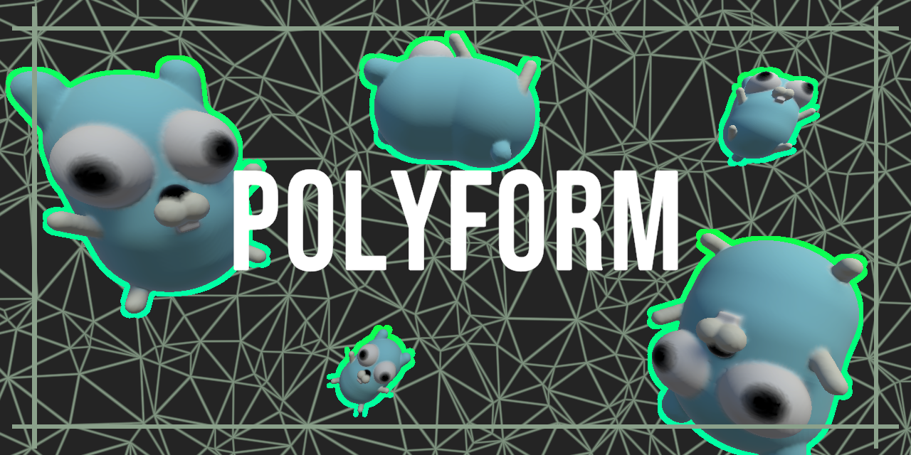

[](https://goreportcard.com/report/github.com/EliCDavis/polyform)
[](https://github.com/EliCDavis/polyform/actions/workflows/cff-validator-complete.yml)


Polyform is for loading, generating, editing, and exporting 3D geometry and it's associated data.


## Overview

- Formats
  - [gltf](/formats/gltf/) - GLTF file format
  - [obj](/formats/obj/) - OBJ file format
  - [ply](/formats/ply/) - PLY file format
  - [colmap](/formats/colmap/) - Utilities for loading COLMAP reconstruction data
  - [opensfm](/formats/opensfm/) - Utilities for loading OpenSFM reconstruction data
  - [splat](/formats/splat/) - Guassian splatting's SPLAT format
- Modeling
  - [meshops](/modeling/meshops/) - All currently implemented algorithms for transforming meshes. 
  - [marching](/modeling/marching/) - Multi-threaded Cube Marching algorithm and utilities.
  - [extrude](/modeling/extrude/) - Functionality for generating geometry from 2D shapes.
  - [repeat](/modeling/repeat/) - Functionality for copying geometry in common patterns.
  - [primitives](/modeling/repeat/) - Functionality pertaining to generating common geometry.
  - [triangulation](/modeling/triangulation/) - Generating meshes from a set of 2D points.
- Drawing
  - [coloring](/drawing/coloring/) - Color utilities for blending multiple colors together using weights.
  - [texturing](/drawing/texturing/) - Traditional image processing utilities (common convolution kernels).
    - [normals](/drawing//texturing/normals/) - Utilities for generating and editing normal maps. 
- [Math](/math/README.md)
  - [colors](/math/colors/) - Making working with golang colors not suck as much.
  - [curves](/math/curves/) - Common curves used in animation like cubic bezier curves.
  - [geometry](/math/geometry/) - AABB, Line2D, Line3D, Plane, and Rays.
  - [noise](/math/noise/) - Utilities around noise functions for common usecases like stacking multiple samples of perlin noise from different frequencies.
  - [quaternion](/math/quaternion/) - Quaternion math and helper functions
  - [sample](/math/sample/) - Serves as a group of definitions for defining a mapping from one numeric value to another
  - [sdf](/math/sdf/) - SDF implementations of different geometry primitives, along with common math functions. Basically slowly picking through [Inigo Quilez's Distfunction](https://iquilezles.org/articles/distfunctions/) article as I need them in my different projects.
- [Generator](/generator/) - Application scaffolding for editing and creating meshes
- [Trees](/trees/) - Implementation of common spatial partitioning trees.

Packages that have spawned from polyform's undertaking and have since been refactored into their own repositories:

- [vector](https://github.com/EliCDavis/vector) - Immutable vector math library
- [iter](https://github.com/EliCDavis/iter) - Iterator and utilities. Some inspiration from ReactiveX
- [quill](https://github.com/EliCDavis/quill) - Scheduler of operations on in-memory data
- [sfm](https://github.com/EliCDavis/sfm) - Utilities for interacting with reconstruction data from different SFM programs
- [bitlib](https://github.com/EliCDavis/bitlib) - Utilities for reading and writing binary data

## Procedural Generation Examples

You can at the different projects under the [examples](/examples/) folder for different examples on how to procedurally generate meshes.

### Evergreen Trees

This was my [submission for ProcJam 2022](https://elicdavis.itch.io/evergreen-tree-generation). Pretty much uses every bit of functionality available in this repository.

[[Source Here](/examples/chill/main.go)]


### Other Examples

|                                                                                      |                                                                                     |
| ------------------------------------------------------------------------------------ | ----------------------------------------------------------------------------------- |
| [[Source Here](/examples/ufo/main.go)]                  | [[Source Here](/examples/candle/main.go)]     |
| [[Source Here](/examples/terrain/main.go)]  | [[Source Here](/examples/covid/main.go)]       |
| [[Source Here](/examples/plumbob/main.go)]  | [[Source Here](/examples/oreo/main.go)]             |


## Developing

If you so happen to want to build a configurator example, my preferred workflow is:

Set up the example to use the [`generator`](./generator/) package that allows you to quickly spin up a web viewer to visualize the geoemetry of your program.

Use [air](https://github.com/cosmtrek/air) to live reload the examples as you build them out.
Set `cmd = "go build -o ./tmp/main.exe ./examples/MY_EXAMPLE"`.
Set `include_ext = ["go", "tpl", "tmpl", "html", "js"]`.

```bash
air serve --port 8080
```

As you hit save on your go code, the webserver will restart, and the web page will automatically refresh itself.

If you want to mess with modern web browser features and need https, I recommend taking a look at https://github.com/FiloSottile/mkcert


```bash
mkcert -install
mkcert -key-file key.pem -cert-file cert.pem localhost
air serve --port 8080 --ssl

# And if you want to connect with your headset
air serve --port 8080 --ssl --host 0.0.0.0
```

## WASM Dev

Install [tinygo](https://github.com/WebAssembly/binaryen) and [binaryren](https://github.com/WebAssembly/binaryen)

Compile the `polywasm` app

```bash
go install ./cmd/polywasm
```

Then build your example app

```bash
polywasm build --app-path ./examples/MY_EXAMPLE
```

## Processing Example

Reads in a obj and applies the cube marching algorithm over the meshes 3D SDF.

```go
package main

import (
  "github.com/EliCDavis/polyform/formats/obj"
  "github.com/EliCDavis/polyform/modeling"
  "github.com/EliCDavis/polyform/modeling/marching"
  "github.com/EliCDavis/polyform/modeling/meshops"
  "github.com/EliCDavis/vector"
)

func main() {
  loadedMesh, _ := obj.Load("test-models/stanford-bunny.obj")

  resolution := 10.
  scale := 12.

  transformedMesh := loadedMesh.Transform(
    meshops.Center3DTransformer{},
    meshops.Scale3DTransformer{Amount: vector3.Fill(scale)},
  )

  canvas := marching.NewMarchingCanvas(resolution)
  meshSDF := marching.Mesh(transformedMesh, .1, 10)
  canvas.AddFieldParallel(meshSDF)
  
  obj.Save("chunky-bunny.obj", canvas.MarchParallel(.3))
}
```

Results in:


## Todo List

Progress towards V1...

- [ ] Finalize Material Definition (or remove and defer to file format specifications)
- [ ] Finalize Node error propogation flow
- [ ] Cleanup Node interface
- [ ] Finalize package organization for node equivalent functionality (ie vector3 => vecn3)
- [ ] Proper WASM Deployment  

Things I want to implement eventually...

- [x] Cube Marching
- [x] Bezier Curves
- [ ] Slice By Plane
- [ ] Slice By Bounding Box
- [ ] Constrained Delaunay Tesselation
- [x] Meshing Pipeline
- [x] Bones / Animations
- [ ] Quadric Error Decimation
- [x] Proper Build Pipeline
- [x] Documentation Website
- [ ] Primitive Meshes
  - [x] Cube
  - [ ] Sphere
    - [x] UV
    - [ ] Ico
    - [ ] Quad
  - [x] Cylinder
  - [x] Quad
  - [x] Circle
  - [ ] Cone
  - [ ] Capsule
  - [ ] Hemisphere
  - [ ] Rounded Cube
- [ ] SDFs
  - [x] Box
  - [x] Line
  - [x] Plane
  - [x] Sphere
  - [x] Rounded Cylinder
  - [x] Rounded Box
  - [ ] Torus
  - [ ] Box Frame
  - [ ] Cone
  - [ ] Rounded Cone
  - [ ] Elipsoid
  - [ ] Triangle
- [ ] 3D Tesselation
- [ ] Slice By Octree
- [ ] Poisson Reconstruction
- [ ] Buncha texture patterns
- [ ] Noise...
  - [ ] Simplex
- [ ] Splines...
  - [ ] Catmull
  - [ ] B Spline

## Resources

Resources either directly contributing to the code, or are just interesting finds while researching.

- Noise
  - [Perlin Noise](https://gpfault.net/posts/perlin-noise.txt.html)
    - [Perlin Worms](https://libnoise.sourceforge.net/examples/worms/index.html)
    - [Perline Noise Chapter 5 from "Ray Tracing The Next Week by Peter Shirley](https://raytracing.github.io/books/RayTracingTheNextWeek.html#perlinnoise)
    - [Improving Noise By Ken Perlin](https://mrl.cs.nyu.edu/~perlin/paper445.pdf)
      - [Java Implementation](https://mrl.cs.nyu.edu/~perlin/noise/)
      - [C# Implementation by Keijiro](https://github.com/keijiro/PerlinNoise/blob/master/Assets/Perlin.cs)
  - [Worley/Cellular Noise](https://thebookofshaders.com/12/)
  - [Book of Shaders on Noise](https://thebookofshaders.com/11/)
  - [Simplex Noise](https://en.wikipedia.org/wiki/Simplex_noise)
  - [_Stable Fiddusion: Frequency-domain blue noise generator_ by Steven Wittens](https://acko.net/blog/stable-fiddusion/)
  - Tiling Noise
    - [ _Tiling Noise_ by Ronja](https://www.ronja-tutorials.com/post/029-tiling-noise/)
    - [gamedev.stackexchange _How do you generate tileable Perlin noise?_](https://gamedev.stackexchange.com/questions/23625/how-do-you-generate-tileable-perlin-noise)
- Triangulation
  - Delaunay
    - Bowyer–Watson
      - [A short video overview](https://www.youtube.com/watch?v=4ySSsESzw2Y)
      - [General Algorithm Description](https://en.wikipedia.org/wiki/Bowyer%E2%80%93Watson_algorithm)
    - Constraint/Refinement
      - [Computing Constrained Delaunay Traingulations By Samuel Peterson](http://www.geom.uiuc.edu/~samuelp/del_project.html#implementation)
    - [3 Points To Create a Circle](https://kyndinfo.notion.site/Geometric-Drawings-2cefb8d81ced41d5af532dd7bdfdceee)
  - [Chew's Second Algorithm](https://cccg.ca/proceedings/2011/papers/paper91.pdf)
  - Polygons
    - [Wikipedia](https://en.wikipedia.org/wiki/Polygon_triangulation)
    - [Fast Polygon Triangulation Based on Seidel's Algorithm By Atul Narkhede and Dinesh Manocha](http://gamma.cs.unc.edu/SEIDEL/)
    - [Triangulating a Monotone Polygon
      ](http://homepages.math.uic.edu/~jan/mcs481/triangulating.pdf)
  - Spheres
    - [UV, Ico, Quad](https://www.danielsieger.com/blog/2021/03/27/generating-spheres.html)
- Texturing
  - [Normal Map From Color Map](https://stackoverflow.com/questions/5281261/generating-a-normal-map-from-a-height-map)
- Formats
  - OBJ/MTL
    - [jburkardt MTL](https://people.sc.fsu.edu/~jburkardt/data/mtl/mtl.html)
    - [Excerpt from FILE FORMATS, Version 4.2 October 1995 MTL](http://paulbourke.net/dataformats/mtl/)
  - [Just a ton of formats](https://people.sc.fsu.edu/~jburkardt/data/data.html)
  - GLTF
    - [2.0 Repo](https://github.com/KhronosGroup/glTF/blob/main/specification/2.0)
    - [Animations](https://github.com/KhronosGroup/glTF-Tutorials/blob/master/gltfTutorial/gltfTutorial_007_Animations.md)
    - [Full 2.0 Spec](https://registry.khronos.org/glTF/specs/2.0/glTF-2.0.html)
    - [Viewer for Skeleton](https://gltf-viewer.donmccurdy.com/)
- Generative Techniques
  - [Country Flags by vividfax](https://vividfax.notion.site/Generative-Flag-Design-e663bc26f5a54ab48fad1428bc32b610)
  - [Snow by Ryan King](https://www.youtube.com/watch?v=UzJnsqIRbDw)
  - Terrain
    - [World Gen by Leather Bee](https://leatherbee.org/index.php/category/world-gen/)
    - [Procedural Hydrology: Dynamic Lake and River Simulation By: Nicholas McDonald](https://nickmcd.me/2020/04/15/procedural-hydrology/)
    - [The Canyons of Your Mind By JonathanCR](https://undiscoveredworlds.blogspot.com/2019/05/the-canyons-of-your-mind.html)
    - [Simulating hydraulic erosion By Job Talle](https://jobtalle.com/simulating_hydraulic_erosion.html)
    - [Coastal Landforms for Fantasy Mapping](https://www.youtube.com/watch?v=ztemzsxso0U)
  - Planet
    - [Planet Generation](https://archive.vn/kmVP4)
    - [Procedural Gas Giant Planet Textures](https://smcameron.github.io/space-nerds-in-space/gaseous-giganticus-slides/slideshow.html)
  - [Taming Randomness](https://kyndinfo.notion.site/Taming-Randomness-e4351f08ec7c43a7ad47ef2d1dfe2ed8)
  - Plants
    - [Algorithmic Botany](http://algorithmicbotany.org/papers/#abop)
      - [_A common developmental program can produce diverse leaf shapes_ by Adam Runions1, Miltos Tsiantis and Przemyslaw Prusinkiewicz](http://algorithmicbotany.org/papers/leaves.nph.2017.pdf)
      - [_L-SYSTEMS: FROM THE THEORYTO VISUAL MODELS OF PLANTS_ by Przemyslaw Prusinkiewiczy, Mark Hammely, Jim Hananz, and Radomir Mechy](http://algorithmicbotany.org/papers/l-sys.csiro96.pdf)
    - [_L-System User Notes_ Written by Paul Bourke](https://paulbourke.net/fractals/lsys/)
    - [L System On Wikipedia](https://en.wikipedia.org/wiki/L-system)
    - [_An Introduction to Lindenmayer Systems_ by Gabriela Ochoa](https://www1.biologie.uni-hamburg.de/b-online/e28_3/lsys.html)
- Voronoi
  - [Voronoi Edges by Inigo Quilez](https://iquilezles.org/articles/voronoilines/)
- Functions / Curves / Animation Lines
  - [Interpolation and Animation](https://kyndinfo.notion.site/Interpolation-and-Animation-44d00edd89bc41d686260d6bfd6a01d9)
  - [Cubic Bézier by Maxime](https://blog.maximeheckel.com/posts/cubic-bezier-from-math-to-motion/)
- Marching Cubes / SDFs
  - [LUT](http://paulbourke.net/geometry/polygonise/)
  - [Coding Adventure: Marching Cubes By Sebastian Lague](https://www.youtube.com/watch?v=M3iI2l0ltbE)
  - [SDFs](https://iquilezles.org/articles/distfunctions/)
  - [Fast 2D SDF](https://stackoverflow.com/questions/68178747/fast-2d-signed-distance)
  - [Got Subtraction from Here](https://www.ronja-tutorials.com/post/035-2d-sdf-combination/)
- Collisions
  - [Closest point on Triangle](https://gdbooks.gitbooks.io/3dcollisions/content/Chapter4/closest_point_to_triangle.html)
- Ray Tracing
  - [_Ray Tracing in One Weekend by Peter Shirley_](https://raytracing.github.io/books/RayTracingInOneWeekend.html)
  - [_Ray Tracing: The Next Week_](https://raytracing.github.io/books/RayTracingTheNextWeek.html)
  - [Möller-Trumbore Ray-Triangle Intersection](https://www.scratchapixel.com/lessons/3d-basic-rendering/ray-tracing-rendering-a-triangle/moller-trumbore-ray-triangle-intersection.html)
  - [Simulating the Colors of The Sky](https://www.scratchapixel.com/lessons/procedural-generation-virtual-worlds/simulating-sky/simulating-colors-of-the-sky.html)
- Math
  - [Mat3x3 => Quaternion from Blender Source](https://github.com/blender/blender/blob/756538b4a117cb51a15e848fa6170143b6aafcd8/source/blender/blenlib/intern/math_rotation.c#L272)
- Skinning
  [Volumetric Heat Diffusion Skinning by Wolfire Games](http://blog.wolfire.com/2009/11/volumetric-heat-diffusion-skinning/)
- Color Space
  - [Threejs on Color Management](https://threejs.org/docs/#manual/en/introduction/Color-management)
  - [Threejs Colorspace conversion](https://github.com/mrdoob/three.js/blob/e6f7c4e677cb8869502739da2640791d020d8d2f/src/math/ColorManagement.js#L5)
  - [Bartosz Ciechanowski on Color Spaces](https://ciechanow.ski/color-spaces/)
- WFC
  - ["The Wavefunction Collapse Algorithm explained very clearly" - Robert Heaton](https://robertheaton.com/2018/12/17/wavefunction-collapse-algorithm/)
  - [Source code for "The Wavefunction Collapse Algorithm explained very clearly"](https://github.com/robert/wavefunction-collapse)
- UV Unwrapping
  - [_"ABF++ : Fast and Robust Angle Based Flattening"_ Alla Sheffer  Bruno Levy   Maxim Mogilnitsky  Alexander Bogomyakov](https://www.cs.ubc.ca/~sheffa/papers/abf_plus_plus.pdf)
  - OptCuts: Joint Optimization of Surface Cuts and Parameterization
    - [Source Code](https://github.com/liminchen/OptCuts)
    - [Paper](https://www.cs.ubc.ca/labs/imager/tr/2018/OptCuts/doc/OptCuts_small.pdf)
  - _"Variational Surface Cutting"_ by Sharp & Crane, SIGGRAPH 2018
    - [Source Code](https://github.com/nmwsharp/variational-surface-cutting)
    - [Paper](https://www.cs.cmu.edu/~kmcrane/Projects/VariationalCuts/paper.pdf)
  - _Boundary First Flattening_ by <a href="http://rohansawhney.io">Rohan Sawhney</a> and <a href="http://www.cs.cmu.edu/~kmcrane/">Keenan Crane</a>.
    - [Source Code](https://github.com/GeometryCollective/boundary-first-flattening)
    - [Paper](https://www.cs.cmu.edu/~kmcrane/Projects/BoundaryFirstFlattening/paper.pdf)
- Drawing a Line
  - Did not expect to need to look that up
  - [Bresenham's line algorithm (Aliased)](https://en.wikipedia.org/wiki/Bresenham%27s_line_algorithm)
  - [Xiaolin Wu's line algorithm (Anti-Aliased)](https://en.wikipedia.org/wiki/Xiaolin_Wu's_line_algorithm)
- Materials
  - [The PBR Guide Part 2](https://creativecloud.adobe.com/learn/substance-3d-designer/web/the-pbr-guide-part-2)
- Flow Based Programming
  - [Wikipedia Article](https://en.wikipedia.org/wiki/Flow-based_programming)
  - Repositories
    - [Scipipe](https://github.com/scipipe/scipipe)
    - [Flowbase](https://github.com/flowbase/flowbase)
    - [Goflow](https://github.com/trustmaster/goflow)
    - [Gofbp](https://github.com/jpaulm/gofbp)
    - [flow-based-programming](https://github.com/egonelbre/flow-based-programming)
  - Articles
    - [_Flow-based Programming_ by J Paul Rodker Morrison](https://jpaulm.github.io/fbp/index.html)
- Guassian Splatting
  - [https://github.com/antimatter15/splat](https://github.com/antimatter15/splat)
  - [https://github.com/mkkellogg/GaussianSplats3D](https://github.com/mkkellogg/GaussianSplats3D)
  - [https://github.com/shg8/VulkanSplatting](https://github.com/shg8/VulkanSplatting)
  - [Making Gaussian Splats Smaller](https://aras-p.info/blog/2023/09/13/Making-Gaussian-Splats-smaller/) by [Aras Pranckevičius](https://aras-p.info/)
  - [Gaussian Explosion](https://aras-p.info/blog/2023/12/08/Gaussian-explosion/) by [Aras Pranckevičius](https://aras-p.info/)
- Coloring Stuff
  - Color Grading LUT
    - [_3D Game Shaders For Beginners - Lookup Table (LUT)_ by David Lettier](https://lettier.github.io/3d-game-shaders-for-beginners/lookup-table.html)
  - Chromatic Aberration
    - [TomasHubelbauer/canvas-chromatic-aberration](https://github.com/TomasHubelbauer/canvas-chromatic-aberration)

## Web Libraries

Libraries the Webviewer depends on in some capacity

* [three.js](https://github.com/mrdoob/three.js)
* [litegraph.js](https://github.com/jagenjo/litegraph.js)
* [GaussianSplats3D](https://github.com/mkkellogg/GaussianSplats3D)
* [dat.gui](https://github.com/dataarts/dat.gui)

## Citiation

If Polyform contributes to an academic publication, cite it as:

```
@misc{polyform,
  title = {Polyform},
  author = {Eli Davis},
  note = {https://www.github.com/EliCDavis/polyform},
  year = {2024}
}
```
