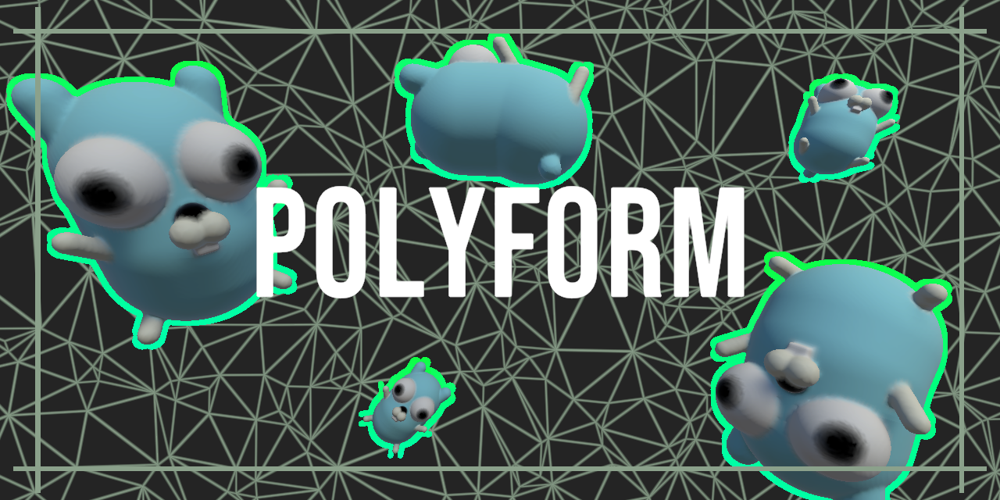
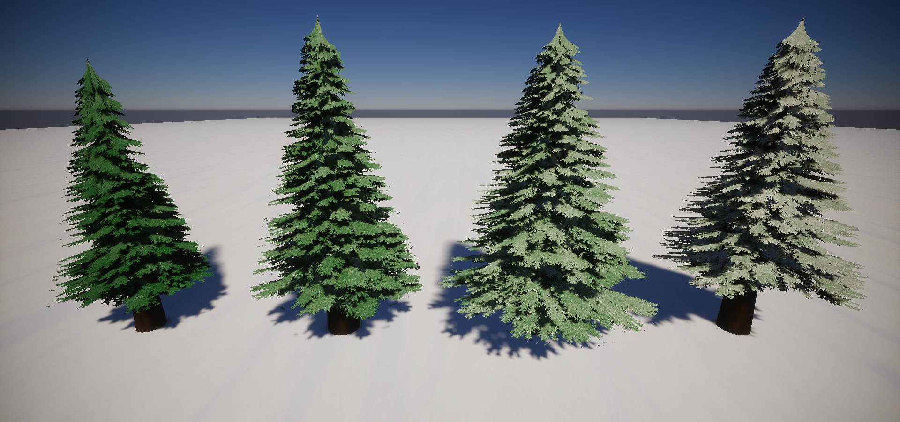

[](https://goreportcard.com/report/github.com/EliCDavis/polyform)
[](https://pkg.go.dev/github.com/EliCDavis/polyform)
[](https://github.com/EliCDavis/polyform/actions/workflows/cff-validator-complete.yml)
[](https://discord.gg/rHAdm6TFX9)

Polyform is a toolkit for developers and artists to load, generate, edit, and export 3D geometry with a focus on immutability, modularity, and procedural workflows.

Developers and artists are welcome to join the [Discord](https://discord.gg/rHAdm6TFX9) to share feedback, get help, or discuss feature requests.

## Try in 30 Seconds

**Try it now in your browser → [Live Demo](https://elicdavis.github.io/polyform/)**

To run it locally, you can download the latest [release](https://github.com/EliCDavis/polyform/releases) and run:

```bash
# Launches the node based editor
polyform edit

# If Golang is installed, clone and run:
npm install && npm run build-dev
go run ./cmd/polyform edit

# If Nix is installed, run:
nix run .#polyform edit
```

## Package Overview

- [Formats](/formats/)
  - [gltf](/formats/gltf/) - GLTF file format
  - [obj](/formats/obj/) - OBJ file format
  - [ply](/formats/ply/) - PLY file format
  - [stl](/formats/stl/) - STL file format
  - [colmap](/formats/colmap/) - Utilities for loading COLMAP reconstruction data
  - [opensfm](/formats/opensfm/) - Utilities for loading OpenSFM reconstruction data
  - [splat](/formats/splat/) - Mkkellogg's SPLAT format
  - [spz](/formats/spz/) - Niantic Scaniverse's [SPZ format](https://scaniverse.com/news/spz-gaussian-splat-open-source-file-format)
  - [potree](/formats/potree/) - Potree V2 file format
- [Modeling](/modeling/)
  - [extrude](/modeling/extrude/) - Functionality for generating geometry from 2D shapes.
  - [marching](/modeling/marching/) - Multi-threaded Cube Marching algorithm and utilities.
  - [meshops](/modeling/meshops/) - All currently implemented algorithms for transforming meshes.
  - [primitives](/modeling/repeat/) - Functionality pertaining to generating common geometry.
  - [repeat](/modeling/repeat/) - Functionality for copying geometry in common patterns.
  - [triangulation](/modeling/triangulation/) - Generating meshes from a set of 2D points.
- [Drawing](/drawing/)
  - [coloring](/drawing/coloring/) - Color utilities for blending multiple colors together using weights.
  - [texturing](/drawing/texturing/) - Traditional image processing utilities (common convolution kernels).
    - [normals](/drawing//texturing/normals/) - Utilities for generating and editing normal maps.
- [Math](/math/)
  - [bias](/math/bias/) - Generic, temperature-scaled, biased random sampler for weighted selection of items
  - [colors](/math/colors/) - Making working with golang colors not suck as much.
  - [curves](/math/curves/) - Common curves used in animation like cubic bezier curves.
  - [geometry](/math/geometry/) - AABB, Line2D, Line3D, Plane, and Rays.
  - [kmeans](/math/kmeans/) - Generic k-means clustering algorithm across 1D to 4D vector spaces.
  - [mat](/math/mat/) - 4x4 Matrix implementation
  - [morton](/math/morton/) - 3D Morton encoder that maps floating-point vectors to and from compact 64-bit Morton codes with configurable spatial bounds and resolution.
  - [noise](/math/noise/) - Utilities around noise functions for common usecases like stacking multiple samples of perlin noise from different frequencies.
  - [quaternion](/math/quaternion/) - Quaternion math and helper functions.
  - [sdf](/math/sdf/) - SDF implementations of different geometry primitives, along with common math functions. Basically slowly picking through [Inigo Quilez's Distfunction](https://iquilezles.org/articles/distfunctions/) article as I need them in my different projects.
  - [sample](/math/sample/) - Serves as a group of definitions for defining a mapping from one numeric value to another.
  - [trs](/math/trs/) - Math and utilities around TRS transformations.
- [Generator](/generator/) - Application scaffolding for editing and creating meshes.
- [Trees](/trees/) - Implementation of common spatial partitioning trees.

Packages that have spawned from polyform's undertaking and have since been refactored into their own repositories:

- [Node Flow](https://github.com/EliCDavis/node-flow) - Another Flow-based Node Graph Library
- [vector](https://github.com/EliCDavis/vector) - Immutable vector math library
- [jbtf](https://github.com/EliCDavis/jbtf) - GLTF-inspired JSON schema for embedding arbitrary binaries
- [iter](https://github.com/EliCDavis/iter) - Iterator and utilities. Some inspiration from ReactiveX
- [quill](https://github.com/EliCDavis/quill) - Scheduler of operations on in-memory data
- [sfm](https://github.com/EliCDavis/sfm) - Utilities for interacting with reconstruction data from different SFM programs
- [bitlib](https://github.com/EliCDavis/bitlib) - Utilities for reading and writing binary data

## Contributing

Learn how to [create your own nodes](./docs/guides/CreatingNodes/README.md) for others to use.

## Procedural Generation Examples

You can at the different projects under the [examples](/examples/) folder for different examples on how to procedurally generate meshes.

### Evergreen Trees

This was my [submission for ProcJam 2022](https://elicdavis.itch.io/evergreen-tree-generation).

[[Source Here](/examples/chill/main.go)]



### Other Examples

|                                                                                      |                                                                                  |
| ------------------------------------------------------------------------------------ | -------------------------------------------------------------------------------- |
| [[Source Here](/generator/edit/examples/ufo.json)]                   | [[Source Here](/examples/candle/main.go)]  |
| [[Source Here](/examples/terrain/main.go)]  | [[Source Here](/examples/covid/main.go)]    |
| [[Source Here](/examples/plumbob/main.go)]  | [[Source Here](/examples/oreo/main.go)]          |


## Processing Example

Reads in a obj and applies the cube marching algorithm over the meshes 3D SDF.

```go
package main

import (
  "github.com/EliCDavis/polyform/formats/obj"
  "github.com/EliCDavis/polyform/modeling"
  "github.com/EliCDavis/polyform/modeling/marching"
  "github.com/EliCDavis/polyform/modeling/meshops"
  "github.com/EliCDavis/vector"
)

func main() {
  objScene := obj.Load("test-models/stanford-bunny.obj")

  resolution := 10.
  scale := 12.

  transformedMesh := objScene.ToMesh().Transform(
    meshops.CenterAttribute3DTransformer{},
    meshops.ScaleAttribute3DTransformer{Amount: vector3.Fill(scale)},
  )

  canvas := marching.NewMarchingCanvas(resolution)
  meshSDF := marching.Mesh(transformedMesh, .1, 10)
  canvas.AddFieldParallel(meshSDF)

  obj.SaveMesh("chunky-bunny.obj", canvas.MarchParallel(.3))
}
```

Results in:


## Local Development

Polyform's visual editor is a **React + TypeScript** app in [`web/`](web/), built with **Vite** and served by the Go `edit` command. The Go binary embeds the built JS at compile time, so frontend changes require an npm build before `go build` picks them up.

### Prerequisites

- **Go** 1.21+ (to run the edit server and build the CLI)
- **Node.js** 18+ and **npm** (to build the web UI)

### First-time setup

```bash
git clone https://github.com/EliCDavis/polyform.git
cd polyform
npm install
npm run build-dev   # writes generator/edit/html/js/index.js
go run ./cmd/polyform edit
```

Open http://localhost:8080 (or whatever port the server prints).

> `generator/edit/html/js/` is gitignored. A fresh clone has no bundled JS until you run `npm run build-dev`.

### Web UI development

For UI work, run the **Go API server** and the **Vite dev server** together. Vite gives you hot module replacement (HMR); API calls are proxied to Go.

**Terminal 1 — Go backend:**

```bash
go run ./cmd/polyform edit
# or, with live reload for Go changes:
air edit
```

**Terminal 2 — React frontend:**

```bash
npm run watch-dev
```

The Vite dev server proxies REST and WebSocket traffic to `localhost:8080`. If your Go server uses a different port, update the proxy targets in [`web/vite.config.ts`](web/vite.config.ts).

### Go-only development

If you are only changing Go code and not the web UI, you can skip Vite and use the last built bundle:

```bash
npm run build-dev   # only when web/ changed
go run ./cmd/polyform edit
```

### npm scripts

| Script | Purpose |
|--------|---------|
| `npm run watch-dev` | Vite dev server with HMR (local UI development) |
| `npm run build-dev` | Production bundle → `generator/edit/html/js/index.js` |
| `npm run build-prod` | Same as `build-dev` with production mode |
| `npm run lint` | ESLint on `web/src/` |

### Live reload with Air

[Air](https://github.com/cosmtrek/air) reloads the Go server when backend files change. Include frontend source extensions if you want Air to restart when you touch the web tree (you still need Vite for HMR):

```toml
# .air.toml
[build]
  cmd = "npm run build-dev && go build -o ./tmp/main.exe ./cmd/polyform"
  include_ext = ["go", "tpl", "tmpl", "html", "ts", "tsx"]
```

Then:

```bash
air edit
```

For active UI work, prefer **`npm run watch-dev` + `go run ./cmd/polyform edit`** instead of rebuilding the bundle on every save.

### HTTPS / WebXR

Some browser features (WebXR, shared memory) need HTTPS. [mkcert](https://github.com/FiloSottile/mkcert) is a simple way to get local TLS certs:

```bash
mkcert -install
mkcert -key-file key.pem -cert-file cert.pem localhost
air edit --port 8080 --ssl

# To reach a VR headset on your LAN:
air edit --port 8080 --ssl --host 0.0.0.0
```

When using Vite alongside TLS Go, point the Vite proxy at your HTTPS origin or run without Vite and use the embedded bundle from `polyform edit --ssl`.

### WASM deployment

The same web bundle is embedded into a WASM build of the CLI. **Build the JS first**, then compile WASM:

```bash
npm run build-dev
go install ./cmd/polywasm
GOOS=js GOARCH=wasm go build -ldflags="-w -s" -o main.wasm ./cmd/polyform
polywasm build --wasm main.wasm
polywasm serve   # serves the static wrapper (splash + service worker + main.wasm)
```

Nix release builds run `npm run build-dev` automatically before `go build` (see [`flake.nix`](flake.nix)).

### Nix

```bash
nix run .#polyform edit
```

The Nix derivation builds the website npm package and copies `generator/edit/html/*` into the Go build before compiling.

## Citation

If Polyform contributes to an academic publication, cite it as:

```
@misc{polyform,
  title = {Polyform},
  author = {Eli Davis},
  note = {https://www.github.com/EliCDavis/polyform},
  year = {2025}
}
```
