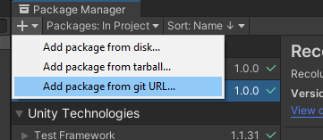
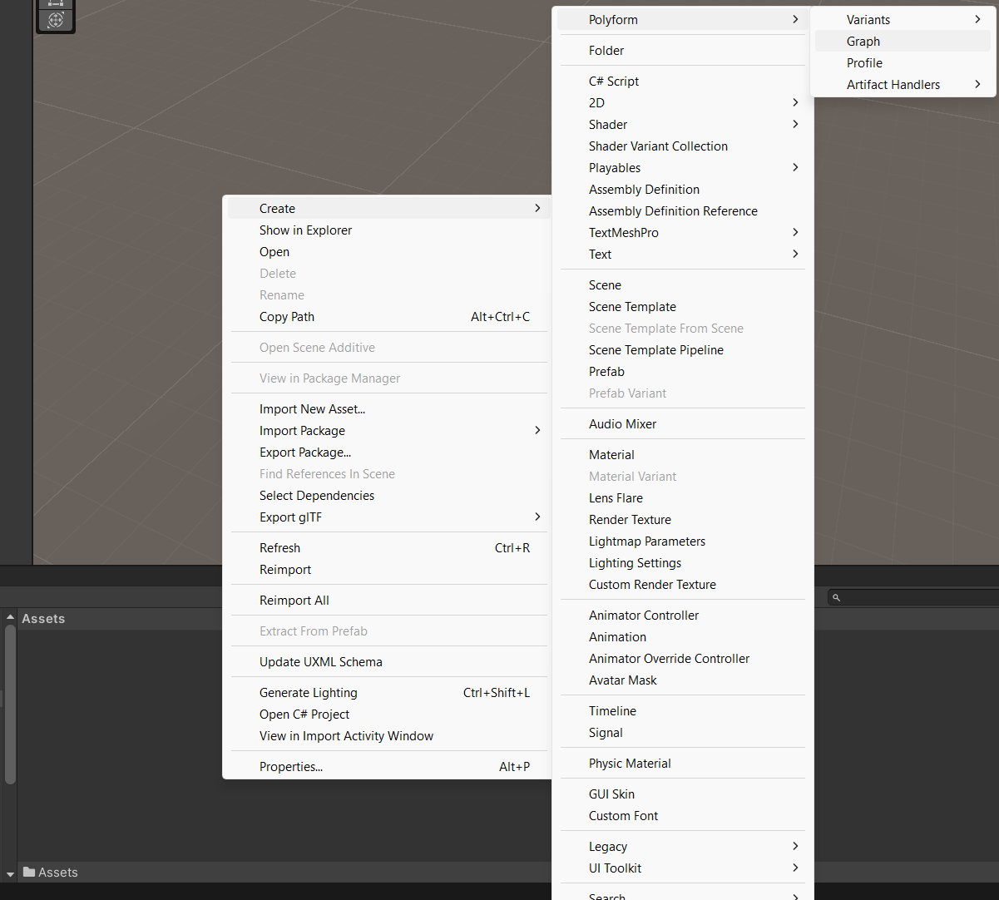
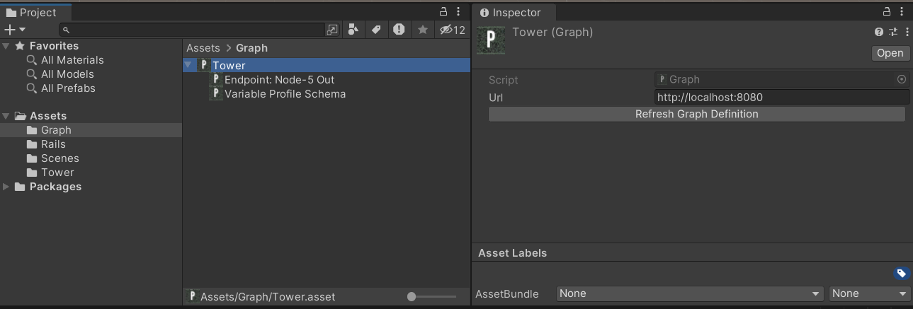
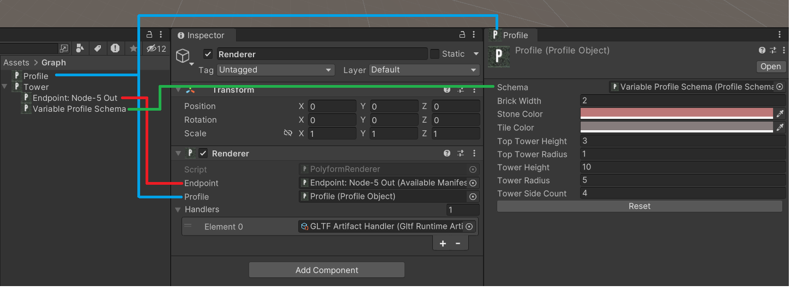
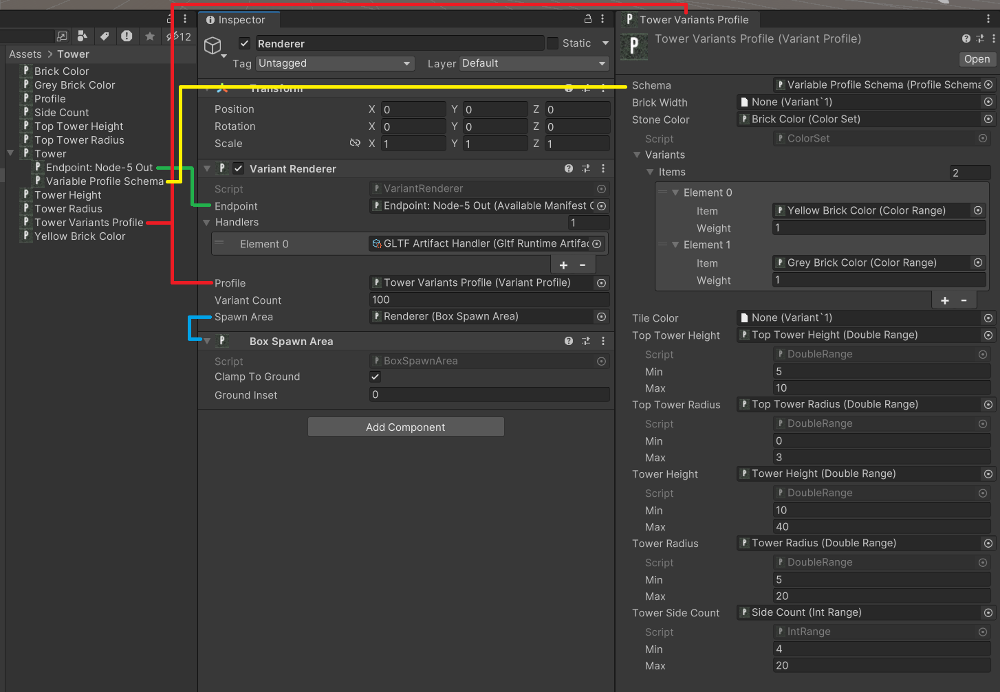

[Table of Contents](../../README.md)

# Unity Integration

## Installation

**The two packages you probably want to get started are `Polyform.Core` and `Polyform.Gltf`** 

Make sure `git` is installed on your machine.

All Unity packages available under the [/unity-packages](../../unity-packages/) directory within this repository. Available packages include:

* `polyform` - Core functionality for loading and visualizing graph manifest data in Unity.
* `polyform.gltf` - Support for importing and rendering GLTF-based manifest outputs.

To install a package:

1. Open Unity's Package Manager (`Window > Package Manager`).
2. Click the `+` button in the top left corner and choose "**Add package from git URL...**"



Then paste the appropriate URL:

```
# Core package:
https://github.com/EliCDavis/polyform.git?path=/unity-packages/polyform

# Optional GLTF support:
https://github.com/EliCDavis/polyform.git?path=/unity-packages/polyform.gltf
```

## Deploying a Graph

Before Unity can load a graph, a Polyform server needs to be running to serve the graph’s content.

1. Download the latest CLI executable from the [Releases Page]((https://github.com/EliCDavis/polyform/releases)).
2. Start the server with a graph file:

```bash
polyform serve --graph ./generator/edit/examples/tower.json
```

This will start a local server exposing the manifest endpoints defined in the graph.

## Using

### Creating a Graph Asset

Once your server is running, Unity can connect to it via a Graph asset.

1. In Unity, right-click in the Project view and go to `Create > Polyform > Graph`.
2. Set the Graph URL to the address of the running Polyform server (e.g., http://localhost:8080).
3. Click Refresh Graph Definition.

This will:

1. Load available manifest nodes as "endpoints" located as child objects under the graph.
2. Compute the "Profile Schema" we can use to configure the graph's exposed variables when calling an endpoint. 







### Manifest Handlers

**Manifest Handlers** are responsible for processing the *entire manifest* returned by a graph endpoint, not just individual artifacts. This allows for more context-aware processing, where logic can depend on relationships between multiple entries or metadata stored at the manifest level.

Instead of interpreting a single output file, a manifest handler can:

* Combine multiple entries into a single GameObject.
* Use metadata in the manifest to drive behavior (e.g., LOD groups, naming conventions, or placement logic).
* Filter or sort which entries to load.
* Perform bulk operations across the entire manifest, like batching or hierarchy creation.

> 📦 To support `.glb`/`.gltf` outputs, install `polyform.gltf`.

Create a handler via:

```
Create > Polyform > Manifest Handlers > Runtime > GLTF
```

When setting up a `Renderer` or `VariantRenderer`, you provide a list of **Manifest Handlers**. These are checked in order when a graph is executed.

1. The manifest is retrieved from the endpoint.
2. Each handler’s `CanHandle()` is called until one returns true.
3. That handler’s `Handle()` is invoked to generate GameObjects.

This process allows for full customization and layered behavior.

### Renderer and Profiles

To execute a graph during gameplay, attach a `Renderer` component to any GameObject.

The `Renderer` allows you to configure:

* **Graph Endpoint** - Select a manifest node to invoke (the final output).
* **Profile** - Set runtime values for exposed graph variables.
* **Handlers** - A prioritized list of manifest handlers used to resolve the endpoint result.

The system will walk through the handler list until one handler claims the `Manifest`.



### Variant Renderer

The Variant Renderer builds on the standard Renderer, but instead of running a graph once, it executes it **multiple times**, sampling from a range of variable values.

The **Variant Profile** defines how input variables in the graph are randomized when using the Variant Renderer. Instead of assigning a fixed value to each variable (like in a standard Profile), the variant profile assigns either a:

* Continuous distribution – for numeric or continuous values (floats, ints, colors, vectors, etc.)
* Weighted list – for discrete options (booleans, string labels, aggregations of different distributions, etc.)

Every time the graph is executed by the variant renderer, it samples new input values from these distributions, generating a unique configuration and corresponding output. Distribution types may evolve (e.g., Gaussian, Poisson, etc.), but current support is primarily uniform.

Examples on when you might use a variant renderer include:

* Generating a forest with varied trees.
* Creating randomized city blocks.
* Placing props or architecture on a terrain.

Configuring a Variant Renderer requires:

* **Variant Profile** - A profile where each variable has a value *range* or *distribution* instead of a fixed value.
* **Spawn Area** - The region in world space where graph outputs will be instantiated.
* **Sampling Count** - How many times the graph should be run (i.e., how many variations to create).

Each run receives a new randomized profile and writes a unique manifest, which the manifest handlers interpret and render.



Below is an example of variant-based generation:


### Editor

#### Manifest Importer

The **Manifest Importer** is a ScriptableObject that executes a graph endpoint and imports the resulting manifest using one or more `EditorManifestHandler`s. It acts as a bridge between a `graph + profile` and asset import into the Unity Editor environment.

You can think of it as a simple entry point for editor-side content generation.

**Usage**

You can create a Manifest Importer from the Unity asset menu:

```
Create > Polyform > Manifest Importer
```

Once created, assign:

* A **Graph Endpoint**
* A **Variant Profile** (optional)
* One or more **Editor Manifest Handlers**

Then click the `Import` button.

#### Editor Manifest Handlers

Editor Manifest Handlers process an entire manifest returned by a graph endpoint and save its entries as project assets. This enables use cases like:

* Baking procedural content (e.g., GLTFs, textures, data files) into the project
* Creating tooling around content previews and editing

The included **File Download Manifest Handler** downloads all manifest entries and writes them to the Unity project's Assets/ directory. You can create one from the Unity asset menu:

```
Create > Polyform > Manifest Handlers > Editor > File Download
```

**Extending for Custom Use**

This handler is a good starting point for custom workflows. For example, you might:

* Create a handler that automatically converts `.gltf` files into Unity prefabs
* Add post-processing steps after file download
* Use manifest metadata to tag or categorize imported assets
* Generate thumbnail previews or summaries

To do so, subclass `EditorManifestHandler` and override:

```csharp
public abstract bool CanHandle(Manifest manifest);
public abstract void Handle(Graph graph, ManifestInstance manifestInstance, ScriptableObject scriptableObject);
```