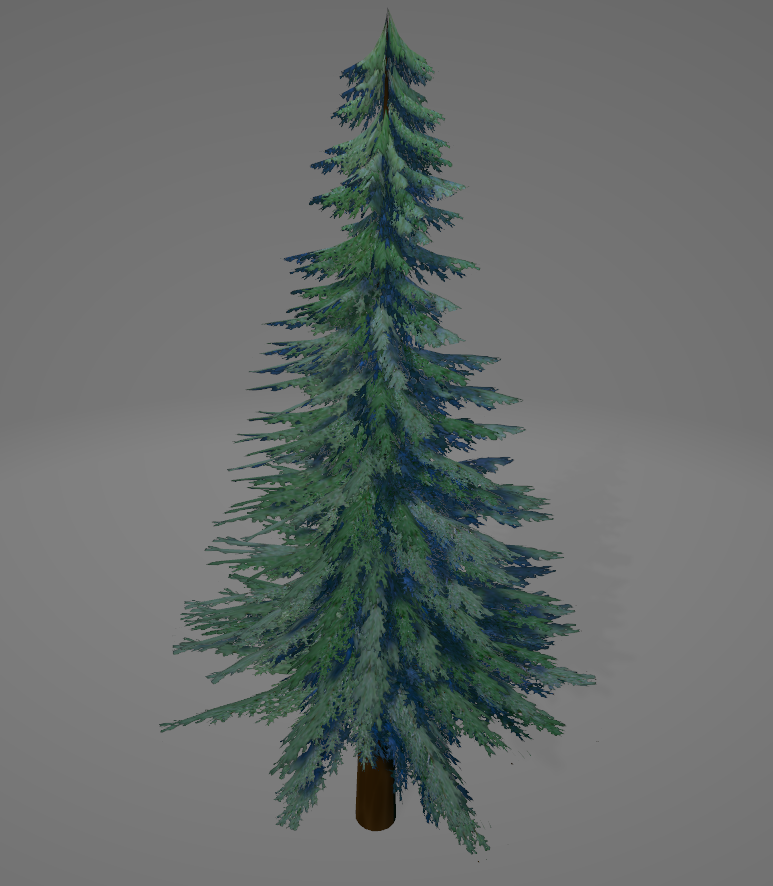
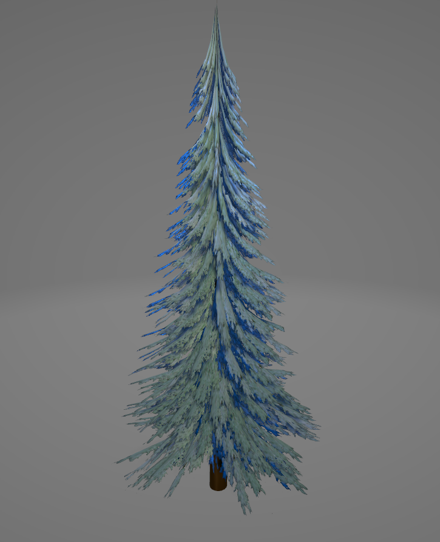
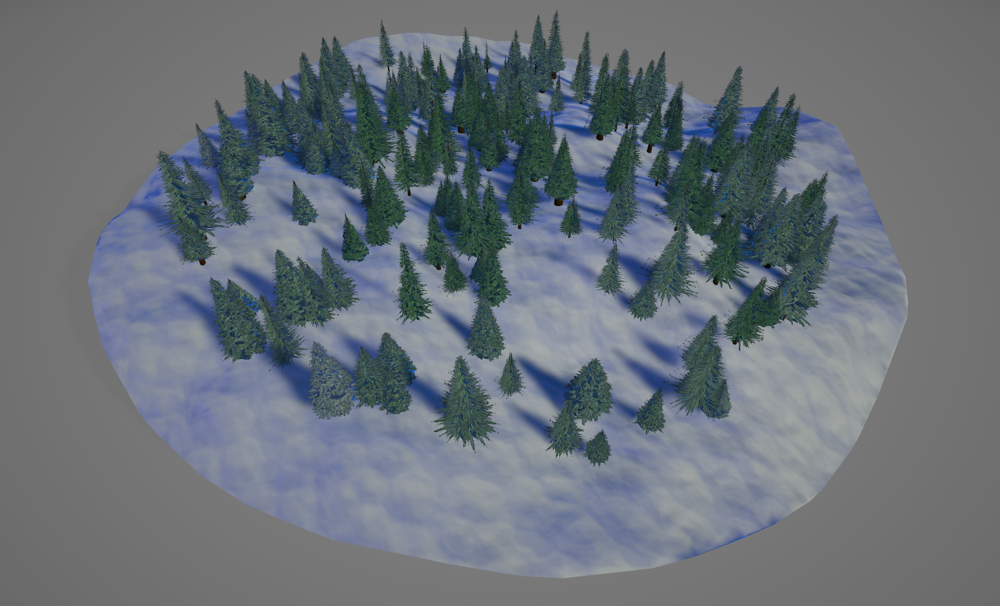
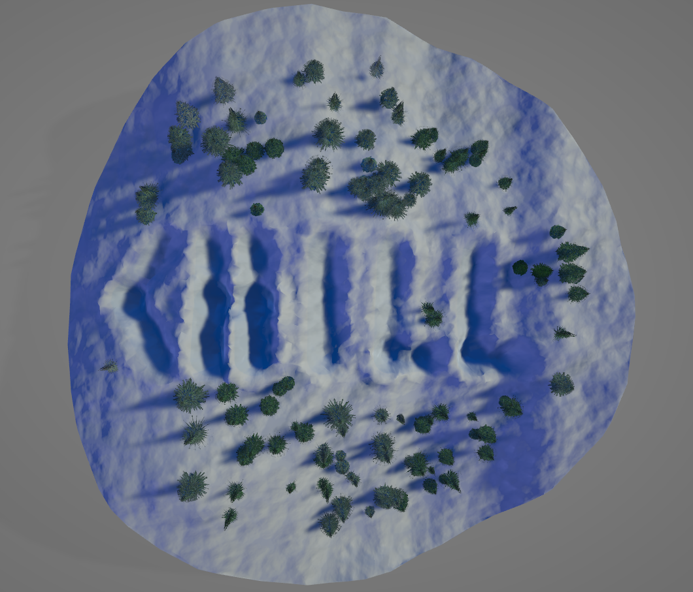

# Chill - ProcJam 2022 Submission

My proc jam submission for the year of 2022 with the theme of "CHILL".

Took the prompt pretty literally because I'm boring, so cold stuff! Snow and stuff.

## Installation

```bash
git clone github.com/EliCDavis/mesh
cd mesh
go install ./examples/chill
```

## Usage

### Tree

```
C:\dev\projects\EliCDavis\mesh>chill tree -h
NAME:
   chill tree

USAGE:
   chill tree [command options] [arguments...]

DESCRIPTION:
   Creates a single tree

OPTIONS:
   --height value    The height of the tree (default: random value between 20 and 45)
   --base value      The width of the tree trunk (default: random value between 0.5 and 2.5)
   --covered value   Percent of the tree's trunk covered by it's branches (default: random value between 0.7 and 0.9)
   --branches value  Number of branches the tree will have (default: random value between 200 and 500)
   --min-snow value  Minimum percentage of snow to use on the branch textures (default: 0.4)
   --max-snow value  Maximum percentage of snow to use on the branch textures (default: 0.7)
   --seed value      The seed fpr the random number generator to use (default: clock time)
   --out value       Path to write the tree obj/mtl/pngs to (default: .)
   --name value      Name of the files that will be generated (default: tree)
   --help, -h        show help (default: false)
```

Creating a random tree from default parameters

```cmd
C:\dev\projects\EliCDavis\mesh>chill tree
2022/12/17 12:58:25 Generating with Seed: 1671303505551071500
```



Upping the snow on the tree, making it short, and naming it snowy

```cmd
C:\dev\projects\EliCDavis\mesh>chill tree --min-snow 0.7 --max-snow 0.9 --height 15 --base 0.3 --name snowy
2022/12/17 13:03:07 Generating with Seed: 1671303787672349300
```




### Forest

```cmd
C:\dev\projects\EliCDavis\mesh>chill forest -h
NAME:
   chill forest

USAGE:
   chill forest [command options] [arguments...]

DESCRIPTION:
   Creates a forest of trees

OPTIONS:
   --max-height value         Max height of the terrain (default: 200)
   --forest-width value       Diameter of forest (default: 400)
   --tree-count value         Number of trees the forest will contain (default: 200)
   --trail value              Path to a JSON file containing trail data
   --min-tree-height value    The minimum height of a tree in the forest (default: 20)
   --min-tree-base value      The minimum width of a trunk of a tree in the forest (default: 0.5)
   --min-tree-covered value   The minimum percent of a tree's trunk covered by it's branches in the forest (default: 0.7)
   --min-tree-branches value  The minimum number of branches a tree will have (default: 200)
   --max-tree-height value    The maximum height of a tree in the forest (default: 45)
   --max-tree-base value      The maximum width of a trunk of a tree in the forest (default: 2.5)
   --max-tree-covered value   The maximum percent of a tree's trunk covered by it's branches in the forest (default: 0.9)
   --max-tree-branches value  The maximum number of branches a tree will have (default: 500)
   --min-snow value           Minimum percentage of snow to use on the branch textures (default: 0.2)
   --max-snow value           Maximum percentage of snow to use on the branch textures (default: 0.9)
   --seed value               The seed fpr the random number generator to use (default: clock time)
   --out value                Path to write the tree obj/mtl/pngs to (default: .)
   --name value               Name of the files that will be generated (default: tree)
   --help, -h                 show help (default: false)
```

Creating a random forest from default parameters

```cmd
C:\dev\projects\EliCDavis\mesh>chill forest
```



I added the ability to define a trail in the snow for some reason, you can do so by passing a json file full of trail segments.

```jsonc
// Example
{
  "segments": [
    {
      "width": 20, // Width of path
      "depth": 10, // How deep the path is cutting into the terrain
      "startX": 200, // Start of path segment in X dimension
      "startY": 200, // Start of path segment in Y dimension
      "endX": 200, // End of path segment in X dimension
      "endY": 300 // End of path segment in Y dimension
    },
    {
        "width": 15,
        "depth": 8,
        "startX": 200,
        "startY": 300,
        "endX": 100,
        "endY": 300
      }
  ]
}
```

Below is an example of using the trail functionality to carve out "CHILL" in the snow

```
C:\dev\projects\EliCDavis\mesh>chill forest --out tmp --trail trail.json --forest-width 500
2022/12/17 14:45:36 Generating with Seed: 1671309936045183900
```

Which produces


